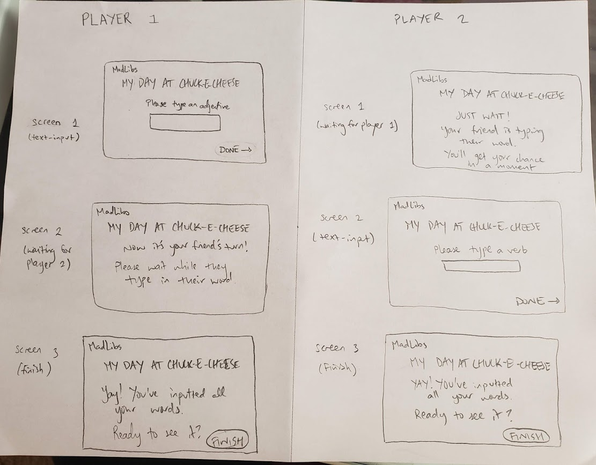

# team-c
INFO 442 Team C

**Team Member Names and Roles:**
- Harkiran Saluja, *Designer*
- Victoria Huynh, *Developer*
- Jill Nguyen, *Developer*
- Markus Shriner, *Project Manager*

**Team Name:** Team Childcare

**Mission Statement:** Enriching child social development in a virtual world.

**Problem Statement:** Before everything went virtual, students were accustomed to attending gatherings in-person. Since the pandemic hit in March, students are forced to stay home and learn online on their own, with parents stepping up as temporary teachers. For students in late elementary school and middle school, this greatly affects their cognitive, non-cognitive, and social abilities since their environment has now drastically changed in their earlier years of life. Most of these skills cannot be solely taught by parents, and social distancing can be particularly difficult for some children. As children get older and more socially adept, friends and peers become increasingly essential for their social development compared to their immediate families. According to Ronald Dahl, a pediatrician who founded the Center for the Developing Adolescent at UC Berkeley, “kids want to figure out who they trust, who likes them, and how to find a niche where they can shine;” they want to be able to develop strong friendships, but this is something they’ve had to put on hold (Denworth, 2020). In a time where support is needed most, children have limited options as to how they can gain that assistance, especially since they likely feel much lonelier now than before. What if there was a way for children to hang out with their friends virtually?

References

_Denworth, L. (2020, June 24). What Happens When Kids Don't See Their Peers for Months.
Retrieved October 14, 2020, from_ https://www.theatlantic.com/family/archive/2020/06/how-quarantine-will-affect-kids-social-development/613381/.

**Solution Statement:**
We envision a collaborative platform that has a bunch of activities that children can do together. One of these activities is a MadLibs game. When in the game lobby with their friend/s, the host user will be presented with a list of potential Mad Libs titles to fill out. The user will receive a prompt and a text box that asks them to input certain parts of speech, such as nouns, verbs, adjectives, and adverbs. In order to input a word on a blank, the user must tap on the blank, and the cursor will appear. The user will then type the word via keyboard as text-based input and then click “DONE”. Afterwards, the other user will receive the same prompt for text input. The first player’s screen will tell them that the other player is inputting text. This will repeat throughout all users involved and all inputs needed for the MadLibs template until the story is ready. At the conclusion of the round, the users will click “FINISH” and the completed story will be presented to all users. We may also have an option where the story could be read aloud for accessibility purposes.

**Logo:**

